# Helix Trading Assistant

<p align="center">
  
</p>

A native macOS and iPad app for monitoring gold, oil, crypto, and index
markets, charting them with technical indicators, and running AI-driven
analyses against live data — built in SwiftUI on top of Apple Charts, GRDB,
and the local `claude` / `codex` / `opencode` CLIs.

> **⚠️ Not financial advice.** Helix Trading Assistant is a personal-use
> research tool. The AI engines generate trade ideas and plans from market
> snapshots; nothing here is investment advice, and no trades are placed
> automatically against a live broker. Use at your own risk.

---

## Features

- **Live multi-source price feed** — Yahoo Finance for XAU/USD (10s ticks),
  TwelveData WebSocket for BTC/ETH/SOL, a Faraz source for WTI Crude and the
  US Dollar Index, and an optional **cTrader bridge**
  (`CTraderBridge/HelixBridgeBot.cs`) that streams broker-grade XAU/USD ticks
  over a loopback socket and takes priority when connected.
- **Interactive charts** — line, candle, or Heikin Ashi; pan + zoom; bar-index
  X-axis so weekend gaps for COMEX don't open visible holes. Split the
  dashboard into a 2- or 4-pane grid, each pane with its own pair, timeframe,
  and indicators.
- **Indicators** — SMA, EMA, Bollinger Bands, UT Bot, RSI, MACD, Stochastic,
  plus a deep order-block suite (base Order Blocks with an exhaustion
  lifecycle, Steroid, Sonarlab, Ranked, Ichimoku-confluence, and
  Volume-Filtered), Fair Value Gaps, three-mode Volume Profile, Ichimoku
  Cloud, Trading Sessions, ZigZag, Change of Character (including
  higher-timeframe zones), and the NY Open / SP2L / Pin Bar Combo / MicroMap /
  Major Trend Reversal strategies. Indicators are multi-instance, each with
  its own parameters and floating settings panel.
- **On-chart position tool** — drop a long or short position onto the chart
  and drag its entry, stop, target, or time extent. Each carries its own
  account balance and risk %, showing live lot size, profit, loss, and R:R.
  Sizing uses per-instrument contract specs so gold, oil, crypto, and indices
  each size correctly.
- **Drawing tools** — horizontal lines, trend lines, rectangles, and Volume
  Profile boxes, anchored to dates so they survive a timeframe switch.
- **AI analysis** — runs against the local **Claude Code** CLI (no API key
  required — reuses your existing Claude session), the **OpenAI Codex** CLI,
  or **OpenCode** (locally or against your own remote OpenCode server).
  Four analysis kinds out of the box:
  - **Full TA** — overall scenario, bias, key levels, trade plan.
  - **Support / Resistance** — extracts structured `LEVELS_JSON` and plots
    horizontal lines directly on the chart.
  - **Fair Value Gaps** — `FVG_JSON` zones drawn as shaded rectangles.
  - **Multi-Timeframe** — bundles 4 timeframes into one prompt for confluence.
- **Auto-trader (paper)** — risk-% lot sizing, paper P&L tracker, strategy
  profiles. Never talks to a real broker — purely a learning sandbox.
- **Journal + Alerts** — keep multiple separate trade logs, each with its own
  win rate and P&L, with per-trade AI post-mortems and day/week/month AI
  reviews. Set price and indicator alerts and watch them fire on the chart.
- **Notification Inbox** — every alert collected into one filterable history
  with unread badges, instead of relying on macOS Notification Center.
- **Economic calendar** — ForexFactory feed filtered by impact, with events
  plotted as markers along the chart's time axis.
- **Replay mode** — step the chart forward bar by bar from any anchor point.
- **In-app updates** — Settings → Updates checks GitHub releases, shows the
  new version's notes, and downloads the `.dmg` for you.
- **First-run wizard** — collects all API keys / endpoints / CLI paths so the
  open-source build ships with zero secrets baked in.

---

## How it works

```
                                                ┌──────────────────────────┐
   Yahoo Finance ──────────┐                    │  Helix Trading.app       │
   TwelveData WS ──────────┤  Fetching/         │                          │
   Faraz (WTI, DXY) ───────┤  ─────────────►    │  ┌────────────────────┐  │
   ForexFactory calendar ──┘                    │  │  GRDB SQLite       │  │
                                                │  │  ohlc, snapshots,  │  │
   cTrader desktop                              │  │  alerts, journal   │  │
   ┌─────────────────────┐                      │  └────────────────────┘  │
   │ HelixBridgeBot.cs   │ ── JSON / TCP ─────► │                          │
   │ (XAU/USD ticks +    │   loopback :7878     │  Apple Charts            │
   │  bar closes)        │                      │  + Indicators            │
   └─────────────────────┘                      │                          │
                                                │  ┌────────────────────┐  │
   ~/.claude/bin/claude  ◄── stdin/stdout ───── │  │ AI/ClaudeEngine    │  │
   ~/.local/bin/codex    ◄── stdin/stdout ───── │  │ AI/CodexEngine     │  │
   opencode (local/remote) ◄── stdin/HTTP ───── │  │ AI/OpenCodeEngine  │  │
                                                │  └────────────────────┘  │
                                                └──────────────────────────┘
```

- **Fetching** (`GoldMonitorMac/Fetching/`) — concurrent HTTP / WebSocket
  sources, each independently retryable. Results land in GRDB.
- **Scheduling** (`GoldMonitorMac/Scheduling/`) — `YahooScheduler` (10s),
  `CTraderScheduler`, snapshot fetchers. Each runs on its own timer.
- **Storage** (`GoldMonitorMac/Storage/`) — `GRDB.DatabasePool` under
  `~/Library/Application Support/HelixTrading/`. Writes serialise; reads
  parallelise.
- **AI engines** (`GoldMonitorMac/AI/`) — spawn the local CLI binary as a
  subprocess, write the prompt to stdin, parse the streaming NDJSON output as
  it arrives. No HTTP, no API keys in this codebase.
- **UI** (`GoldMonitorMac/Features/`) — SwiftUI views. Dashboard owns the
  chart; AIAnalysis owns the report column; everything else is its own
  feature folder.

See [`AGENTS.md`](AGENTS.md) for the detailed architecture notes, persistence
patterns, and gotchas for contributors — it is the single working brief for
this repository.

---

## Requirements

| What | Why | How `./run.sh` handles it |
|---|---|---|
| **macOS 13+** | Apple Charts baseline | — |
| **Xcode 15+** | Swift 5.9, SwiftUI compiler | Manual (App Store) |
| **Homebrew** | for `xcodegen` + `node` | Auto-installed if missing |
| **xcodegen** | regenerates `.xcodeproj` from `project.yml` | `brew install xcodegen` |
| **Node.js + npm** | required by the Claude / Codex / OpenCode CLIs | `brew install node` |
| **`claude` CLI** | drives Claude Code engine | `npm i -g @anthropic-ai/claude-code` |
| **`codex` CLI** *(optional)* | drives the Codex engine | `npm i -g @openai/codex` |
| **`opencode` CLI** *(optional)* | drives the OpenCode engine (or point it at a remote server) | `npm i -g opencode-ai` |
| **TwelveData API key** *(optional)* | live crypto stream (free tier OK) | Wizard, on first launch |
| **cTrader Desktop** *(optional)* | broker-grade XAU/USD ticks | Wizard + see `CTraderBridge/` |

You only need **Xcode + Homebrew** to start. `./run.sh` bootstraps the rest.

---

## Quick start

```bash
git clone git@github.com:pouyaam/HelixTradingAssistant.git
cd HelixTradingAssistant
./run.sh
```

That's it. The script will:

1. Verify (and install if needed) Homebrew, xcodegen, Node.js.
2. Install the `claude` CLI globally (`npm i -g @anthropic-ai/claude-code`).
3. Install the `codex` CLI globally (`npm i -g @openai/codex`).
4. Regenerate `HelixTradingApp.xcodeproj` from `project.yml`.
5. Build into `./build/` (predictable DerivedData path).
6. Launch the app.

On first launch, the **setup wizard** walks you through:

1. **Welcome** — permission ask.
2. **Claude** — auto-detects the `claude` binary; if found, you're done. If
   not, follow the on-screen install instructions.
3. **Data sources** — paste your TwelveData key (free tier at
   <https://twelvedata.com>) and confirm the ForexFactory calendar URL.
4. **cTrader** *(optional)* — toggle the bridge and choose a loopback port,
   then follow [`CTraderBridge/README.md`](CTraderBridge/README.md) to install
   the cBot.
5. **Done** — you're trading. Re-runnable from Settings.

You can re-run the wizard any time from **Settings → Run setup wizard**.

---

## iPad app

A native iPad target (`HelixTradingAppiPad`) shares the same data model, AI
engines, indicators, and storage as the Mac app. It runs independently — no
Mac required at runtime.

### Building for iPad

```bash
# Simulator
./run.sh --ipad          # lists devices, pick one, build & run

# Real device (requires Apple ID in Xcode → Settings → Accounts)
DEVELOPMENT_TEAM=<your-team-id> ./run.sh --ipad
```

`./run.sh --ipad` lists all iPad simulators (with iOS version and boot state)
and connected real devices. Pick a number and it builds, installs, and launches.

### iPad-specific design

| Feature | iPad |
|---|---|
| Navigation | `NavigationSplitView` sidebar (Dashboard, News, Portfolio, Journal, Inbox, Settings) |
| Pair selection | Dropdown menu in dashboard header (replaces sidebar pair list) |
| Chart controls | Full toolbar: timeframe, chart type, indicators, layers, drawings, replay, alerts, AI analyze, debug, fullscreen |
| Fullscreen | Single chart and grid pane fullscreen — same chromeless chartCard |
| AI engines | OpenCode (remote mode) — Claude/Codex CLI engines are macOS-only |
| Data syncing | Only the selected pair is synced (`focusedPairID`), reducing CPU usage |
| Grid charts | Hidden panes skip data loading entirely |

### Requirements

- **iOS 16+** (Apple Charts baseline)
- **Xcode 15+**
- A development team for real device deployment (free Apple ID works)

---

## Manual build (without `run.sh`)

```bash
# One-time deps
brew install xcodegen node
npm i -g @anthropic-ai/claude-code @openai/codex

# Build
xcodegen generate
open HelixTradingApp.xcodeproj   # then ⌘R in Xcode
```

Or from CLI:

```bash
xcodebuild \
  -project HelixTradingApp.xcodeproj \
  -scheme HelixTradingApp \
  -configuration Debug \
  -destination 'platform=macOS' \
  build
```

---

## `run.sh` flags

```
./run.sh                # debug build, regen + build + launch
./run.sh --release      # release configuration
./run.sh --ipad         # list iPad devices, pick, build & run
./run.sh --dmg          # package a distributable .dmg (implies --release, no launch)
./run.sh --sign         # ad-hoc code-sign the .app before packaging (implies --dmg)
./run.sh --clean        # wipe ./build before building (forces SPM re-resolve)
./run.sh --no-launch    # build only, don't open the .app
./run.sh --quiet        # suppress xcodebuild noise
./run.sh --skip-deps    # don't try to install brew/npm tooling
```

Combine freely: `./run.sh --clean --release --no-launch`.

DMG output lands in `./dist/HelixTradingApp-<version>.dmg`, with the version
read straight out of the built app's `Info.plist`. The image is ad-hoc signed
at most — notarisation needs a Developer ID and `xcrun notarytool`, so on
another Mac the first launch requires right-click → **Open**.

---

## Configuration

All user-configurable values live in **one** place:
[`GoldMonitorMac/App/DataSourceConfig.swift`](GoldMonitorMac/App/DataSourceConfig.swift),
persisted to `UserDefaults` under `dataSourceConfig.v1`. Secrets (Anthropic
API key, SOCKS5 password, backend password) go into the **macOS Keychain**
via [`UI/KeychainHelper.swift`](GoldMonitorMac/UI/KeychainHelper.swift).

**There are no hardcoded keys in this repo.** The open-source build ships
empty and asks you to fill the wizard.

---

## Project layout

```
.
├── GoldMonitorMac/          # Swift sources (directory kept for git history;
│   ├── App/                 #   the bundle is "HelixTradingApp")
│   ├── AI/                  # AIEngine protocol, Claude/Codex engines, prompts
│   ├── Features/            # Dashboard, AIAnalysis, AutoTrader, Journal,
│   │                        # Alerts, Inbox, News, Portfolio, Settings,
│   │                        # Sidebar, Wizard
│   ├── Fetching/            # Yahoo, TwelveData, ForexFactory, cTrader, proxy
│   ├── Models/              # Snapshot, Candle, TradingPair, MarketCalendar
│   ├── Resources/           # AppIcon, AccentColor
│   ├── Scheduling/          # FetchScheduler, YahooScheduler, NewsStore
│   ├── Storage/             # GRDB pool, schema, repos
│   └── UI/                  # Card, buttons, KeychainHelper, WindowConfigurator
├── GoldMonitorMacTests/     # XCTest suite (indicators, setups, sizing)
├── ipadapp/                 # iPad-only views (shares the Mac sources)
├── CTraderBridge/           # cTrader cBot (C#) + setup README
├── Tools/                   # HelixIconGen.swift — regenerates app icons
├── project.yml              # xcodegen spec (source of truth for .xcodeproj)
├── run.sh                   # one-shot bootstrap / build / launch / package
├── dist/                    # built .dmg releases (gitignored)
├── AGENTS.md                # in-depth working brief for contributors
├── CLAUDE.md                # pointer to AGENTS.md
├── sessions/                # per-session work logs
├── LICENSE                  # MIT
└── README.md                # you are here
```

---

## Contributing

PRs welcome. A few ground rules:

- **`project.yml` is the source of truth.** Don't commit `.xcodeproj/`.
  Always run `xcodegen generate` after changing `project.yml`.
- **No new SPM deps without discussion.** Current deps are GRDB and
  swift-markdown-ui only.
- **macOS 13 baseline.** No `@Observable`, no `symbolEffect`, no
  `chartScrollableAxes`, no `Stepper(value:in:step:format:)`. See
  [`AGENTS.md`](AGENTS.md) for the full list of gotchas.
- **`xcodebuild build` before opening a PR** — and confirm the app launches.
- **No hardcoded secrets, ever.** Everything user-configurable goes through
  `DataSourceConfig` + `KeychainHelper`.

---

## Tech stack

- **Swift 5.9** / **SwiftUI** / **Apple Charts** — UI
- **GRDB 7** — SQLite persistence
- **MarkdownUI** — rendering AI analysis output
- **Claude Code CLI** / **OpenAI Codex CLI** — AI backends
- **xcodegen** — declarative `.xcodeproj` generation

---

## License

[MIT](LICENSE) — see the file for details.

---

## Disclaimer

This software is provided "as is" for research and educational purposes only.
The author is not a registered financial advisor. Trade ideas generated by the
AI engines are based on technical patterns in price data and **carry no
guarantee of accuracy or profitability**. Past performance does not predict
future results. Trading carries risk of loss; you can lose more than you
deposit. Do your own research, manage your own risk, and never trade with
money you can't afford to lose.
